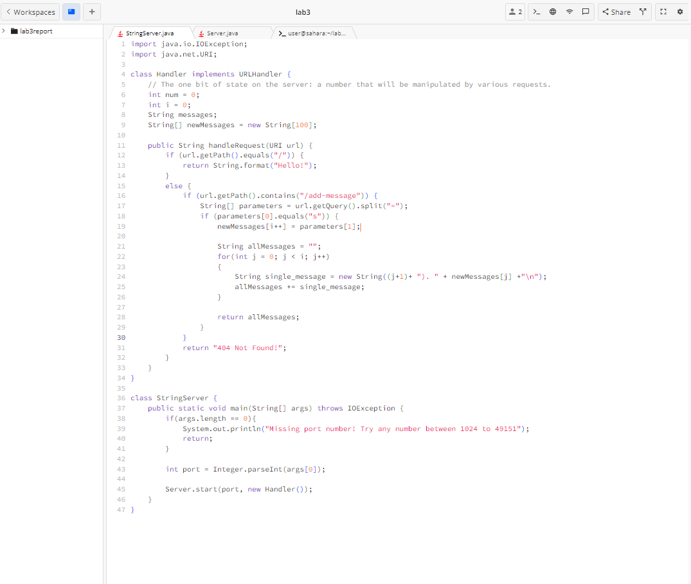
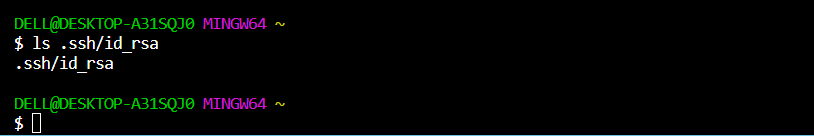
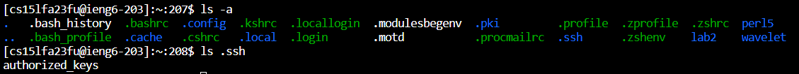

# Lab Report 2- Servers and SSH keys

## Part 1
### Here is the code for my ```StringServer```.

**StringServer.java**


### Here are the two screenshots of using ```/add-message```

#### ```/add-message?s=Hello```
.png)

**Which methods in your code are called?**<be>

When the user requests to add a message by adding the "/add-messages?s=Hello" to the original link, the handleRequest method is being called in the handler class. 

**What are the relevant arguments to those methods, and the values of any relevant fields of the class?**

Inside the ```public String handleRequest(URI url)``` method, url is considered as an argument representing the URI of the request. Therefore, based on the example above, the URI should be ```http://0-0-0-0-4343-1met69e97cp27w2kjp19raqks.us.edusercontent.com/add-message?s=Hello```

The relevant fields of the Handler class are: 
* The integer variable ```i```, which has been initialized to 0. It keeps track of how many messages are stored in the ```newMessage``` array.
* The ```newMessage``` array, which has been declared with a fixed size of 100. This array is used to store the message. Every time when a new message is added, it is stored in this array. 

**How do the values of any relevant fields of the class change from this specific request? If no values got changed, explain why.**

Based on the example above, the value "Hello" is extracted from the query parameter ```s=Hello```, and is added to the ```newMessage``` array at the current value of i. Initially, the integer variable ```i``` was 0 when the ```newMessages``` array was empty. However, after the user's request, the ```newMessage``` array will contain value "Hello" at index 0. Then, the value of i is incremented by 1 to reflect the addition of the new message. 


#### ```/add-message?s=How are you```
.png)

**Which methods in your code are called?**<be>

When the user requests to add a message by adding the "/add-messages?s=How are you" to the original link, the handleRequest method is being called in the handler class again just like it did for the previous request. 

**What are the relevant arguments to those methods, and the values of any relevant fields of the class?**

Inside the ```public String handleRequest(URI url)``` method, url is considered as an argument representing the URI of the request. Therefore, based on the example above, the URI should be ```http://0-0-0-0-4343-1met6997cp27w2kjp19raqks.us.edusercontent.com/add-message?s=How%20are%20you```

The relevant fields of the Handler class are: 
* The integer variable ```i```, which has been incremented by 1, now has a value of 1. It keeps track of how many messages are stored in the ```newMessage``` array.
* The ```newMessage``` array, which has been declared with a fixed size of 100, has a value "Hello" in the first index position at 0. This array is used to store the message. Every time a new message is added, it is stored in this array. 

**How do the values of any relevant fields of the class change from this specific request? If no values got changed, explain why.**

Based on the example above, the value "Hello" is extracted from the query parameter ```s=How+are+you```, and is added to the ```newMessage``` array at the next available position, based on the current value of i, which is ```i = 1```. Initially, the integer variable ```i``` was 1 when the ```newMessages``` array contained the value "Hello" at index 0 from the previous request. However, after this second request, the ```newMessage``` array will contain the value "How+are+you" at index 1. Then, the value of i is incremented by 1 to reflect the addition of the new message. 


## Part 2

### Show with ```ls```
### The path to the private key for my SSH key for logging into ```ieng6``` (on your computer)


### The path to the public key for your SSH key for logging into ```ieng6``` (within my account on ```ieng6```)


### A terminal interaction where you log into ```ieng6``` with your course-specific account without being asked for a password.
.png)
.png)
## Part 3
There are a couple of things I learned from the lab in week 3 that I didn't know before. One thing is how to set up the SSH keys for easy access. I can now log onto my remote account again without having to type out the password. I am so glad that I can do that from my computer. I also got introduced to the two new terminal commands, the ```scp``` and ```mkdir``` command. 

```Scp```: copies directories and files from local machine to remote server.<br>
```Mkdir```: allows you to make a new directory.<br>

